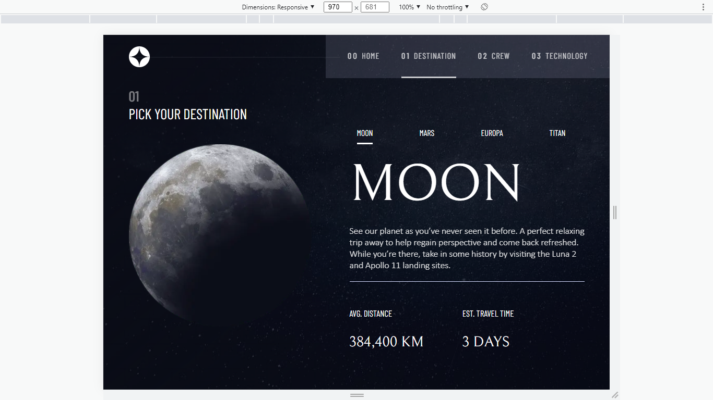

# Frontend Mentor - Space tourism website solution

This is a solution to the [Space tourism website challenge on Frontend Mentor](https://www.frontendmentor.io/challenges/space-tourism-multipage-website-gRWj1URZ3). Frontend Mentor challenges help you improve your coding skills by building realistic projects.

## Table of contents

-   [Overview](#overview)
    -   [The challenge](#the-challenge)
    -   [Screenshot](#screenshot)
    -   [Links](#links)
-   [My process](#my-process)
    -   [Built with](#built-with)
    -   [What I learned](#what-i-learned)
    -   [Continued development](#continued-development)
    -   [Useful resources](#useful-resources)
-   [Author](#author)
-   [Acknowledgments](#acknowledgments)

## Overview

### The challenge

Users should be able to:

-   View the optimal layout for each of the website's pages depending on their device's screen size
-   See hover states for all interactive elements on the page
-   View each page and be able to toggle between the tabs to see new information

### Screenshot

 of /destination route in larger screen

### Links

-   Solution URL: [NextJS - Space-tourism](https://github.com/E-Zbox/NextJS---Space-tourism)
-   Live Site URL: [No live site url](https://your-live-site-url.com)

## My process

### Built with

-   Next JS ⚔️
-   Some tasty javascript functions 🏹
-   Semantic HTML5 markup 🛕
-   CSS custom properties 🎨
-   Flexbox 😁
-   Didn't use styled-components 🤦

-   [React](https://reactjs.org/) - JS library
-   [Next.js](https://nextjs.org/) - React framework

### What I learned

I should have used styled-components 😀. Jokes aside, the JavaScript (Next JS) was quite simple but CSS was something I had to keep testing. You know how JS is, you figure the logic and you are done while in CSS you keep checking to see if you got the right padding, transform property and why the layout is breaking because of some min-width declayed in larger screen 😓.
Anyways, it was fun 🥳 🥳 🥳 . Took me about 2 weeks, though school was in session, so 💆

Some of the lines that I recommend you check

```jsx
... {./components/home/Navbar.jsx}
<div id="menu-button" className="" onClick={(e)=> handleMenuButton(e)}>
    <div className="first"></div>
    <div id="second"></div>
    <div className="third"></div>
</div>
...{./components/technology/Technology.js}
<Image
    align={this.state.image.align}
    layout="fill"
    src={this.state.displayImage}
/>
```

```css
:root {
    // colors
    --white1: #ffffff;
    --white2: #cfd3fc;
    --dark: #0b0d17;
    // typography
    --heading1: 9.375rem;
}
.main-contents {
    --contentsFixedHeight: 350px;
    main#counters {
        width: 210px;
        .space-counter {
            --size: 52px;
        }
    }
```

```js
const [newItem] = this.state.apiData.filter((item, id) => id == index);
```

### Useful resources

-   [React docs](https://reactjs.org/) - Got a bit confused with componentDidMount lifecycle method
-   [Nextjs documentation](https://nextjs.org/) - Helped me in using fill props for image component

## Author

-   Website - [My portfolio site](https://www.my-portfolio-site-is-not-ready.com)
-   Frontend Mentor - [@E-Zbox](https://www.frontendmentor.io/profile/E-Zbox)
-   Twitter - [@ceoCodes](https://www.twitter.com/ceoCodes)

## Acknowledgments

Stackoverflow 🚀🚀🚀
React docs🚀💖 🚀
Next js documentation ✨🚀🚀
